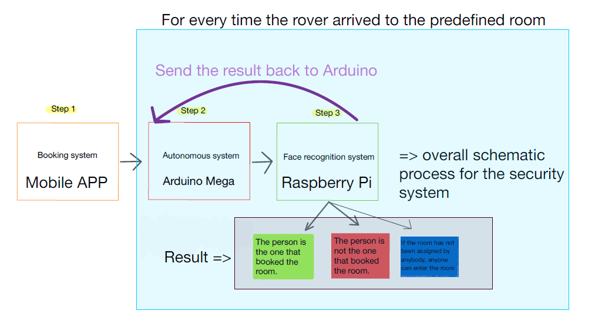

ELEC3848: Integrated Design Project 🚀️

Proposed function:

Our proposed application acts as a surveillance rover that will check each allocated space using a coordinate system and check whether or not users are in their respective areas through facial recognition systems.

[Checkout our "1 miute" presentation 😄  ](https://drive.google.com/file/d/1RdRCgE6A9gnypH7fNhrHm37aY1JPKV4c/view?usp=sharing)
